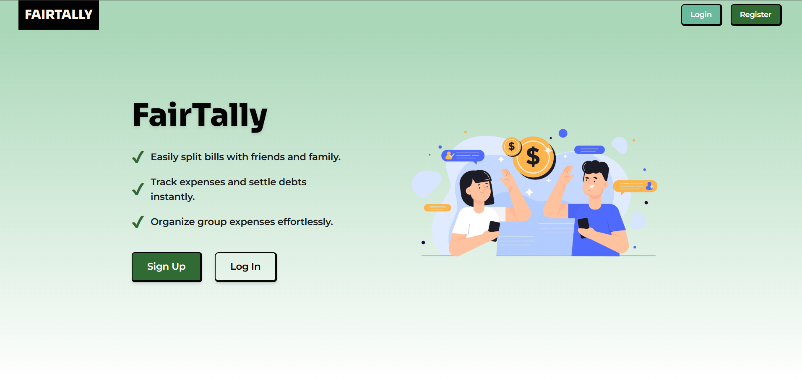
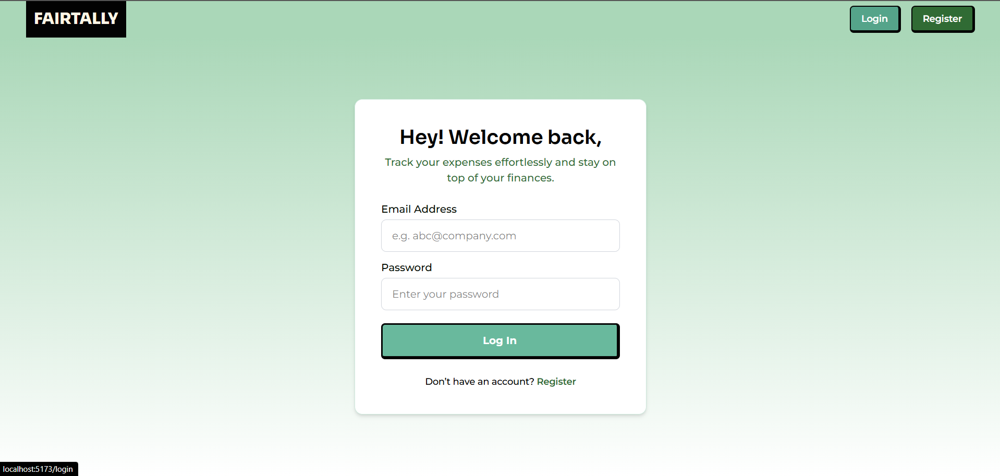
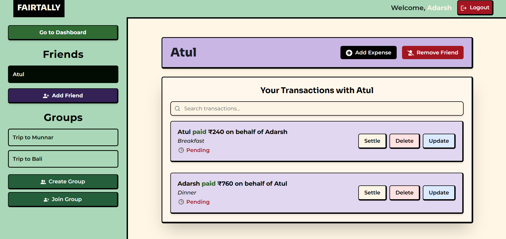
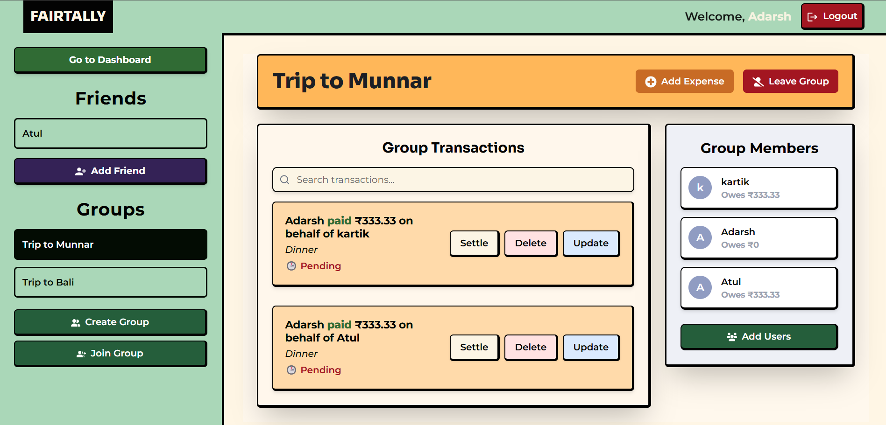

# FairTally
A full-stack web application that emulates the core functionalities of Splitwise, allowing users to manage shared expenses seamlessly. This project leverages a microservices architecture with a Java Spring Boot backend and a React frontend.

## 🛠️ Tech Stack

### Backend
- **Java**  
- **Spring Boot**  
- **Spring Web**  
- **Hibernate (JPA)**  
- **PostgreSQL**  
- **RESTful APIs**

### Frontend
- **React.js**  
- **JavaScript**  
- **CSS**

## 📁 Project Structure

- `server/`: Contains the backend microservices built with Spring Boot.
- `client/`: Contains the frontend application built with React.

## ✨ Features

- **User Authentication**: Secure login and registration functionalities.
- **Group Management**: Create and manage groups for expense sharing.
- **Expense Tracking**: Add, update, and delete expenses within groups.
- **Settlement Algorithm**: Calculate the minimum number of transactions required to settle debts within a group.
- **Dashboard**: View summaries of balances and transaction histories.

## 🚀 Getting Started

### Prerequisites

- **Java 11 or higher**
- **Node.js and npm**
- **PostgreSQL**

### Backend Setup

1. Navigate to the `server` directory:
   ```bash
   cd server
   ```
2. Configure the PostgreSQL database settings in `application.properties`.
3. Build and run the Spring Boot application:
   ```bash
   ./mvn spring-boot:run
   ```

### Frontend Setup

1. Navigate to the `client` directory:
   ```bash
   cd client
   ```
2. Install dependencies:
   ```bash
   npm install
   ```
3. Start the React development server:
   ```bash
   npm run dev
   ```

## 📸 Screenshots

### Home


### Login


### Register


### Dashboard View


### Group Details
